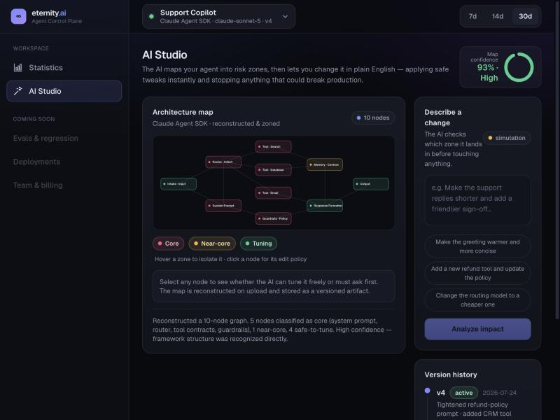
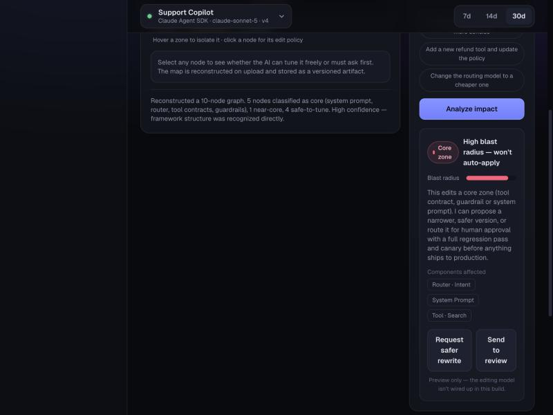
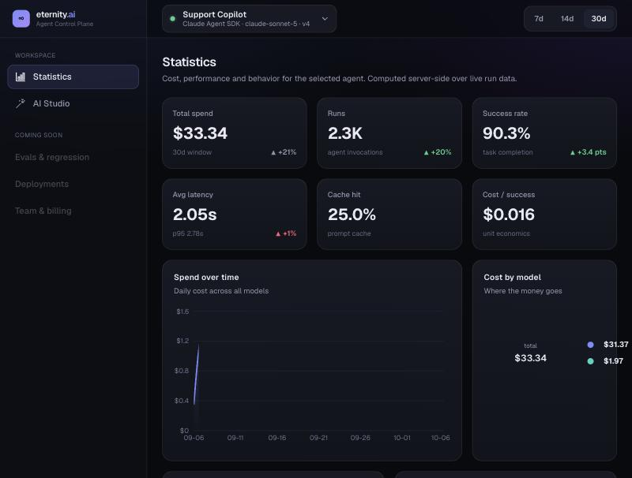

# Fledge

**A control plane for the AI agents a business already runs.** Upload the agent, see what it
costs and how it behaves, then change it in plain English without finding out in production
that you broke it.



Asking for *"add a new refund tool and update the policy"* does not get applied. It lands in a
core zone, so the studio refuses and offers a narrower rewrite or human review instead:



Cost, latency, success rate and cache hits, computed server-side from runs the agent reports:



> Screenshots are of this MVP snapshot running locally. In the private build the editor is
> wired to the engine, so the same refusal comes from a real replay rather than a preview.

## The problem

Changing a deployed agent means editing a prompt and hoping. The edit looks fine, ships, and
two days later support tickets say it stopped escalating refunds. Nothing told you, because
nothing measured the agent's behaviour before and after.

## What Fledge does about it

1. **Reads the agent** and sorts its instructions into **core**, **near-core** and **tuning**.
2. **Restates your change** in its own words and waits for you to confirm it understood.
3. **Applies the edit**, then **replays test conversations** against the edited agent.
4. **Refuses the change** if behaviour moved somewhere it should not have.
5. Keeps every applied change as a version, so undo is one click.

A real refusal, from the engine's own job log: the request was *"refunds over 200 dollars
should go to a human"*, and the verdict came back `blocked — DO NOT APPLY, 1 conversation
changed that shouldn't have`. That is the product working. The edit was plausible and it
would have broken something.

## Why risk zones

An agent is non-deterministic, so "this edit is safe" cannot honestly be promised. What can
be promised is that a change is **measured, reversible, and caught before production**.
Sorting instructions into three bands is what makes that affordable: tuning changes apply
immediately, core changes are blocked and offered a safer rewrite, and only the middle band
needs a full replay. Checking everything at the same depth would make the product unusably
slow.

## Status

Running since September 2026 on an ARM cloud box, HTTPS, signup invite-only. Agents report
their own runs, so the statistics are measured rather than estimated: until an agent reports
anything its tab stays empty on purpose and shows you how to connect it. Every model call the
product makes is attributed to a customer and priced, with a monthly cap that refuses new
work rather than running up a bill.

> TODO(me): add the live URL if you want reviewers to reach it, or leave it out while signup
> is invite-only.

## What is in this repository

**This repo is the public MVP snapshot.** Development continued in a private repository with
team Artifex, where the editor is wired to a real engine. The snapshot's analytics and API are
real, computed server-side over seeded run data; its editor is a visual and interaction stub.

Next.js (App Router), TypeScript, Tailwind, Recharts, SQLite. UI talks to thin API routes,
routes talk to services, services talk to one repository layer where every query filters on
the id of the user making the request, so a missing ownership check cannot be written.

## Credits

Built with team Artifex. Commits in this snapshot are authored from a teammate's machine; the
work was done together.

## Snapshot detail

## What's here

**Statistics** — cost, tokens, latency (p50/p95), success rate, cache-hit, cost-per-success, version comparison, drift alerts, top intents and cost-by-tool. All computed server-side and filterable by agent and time range.

**AI Studio** — the reconstructed architecture map with **core / near-core / tuning** risk zones, a map-confidence score, version history, and an impact classifier that routes a proposed change to the right zone (safe tweaks apply instantly; core-zone changes are blocked and offered a safer rewrite).

## Architecture

UI → thin API routes → services → **repository**. Everything reads through `src/lib/data/repository.ts`, so the seeded in-memory store swaps for a real database without touching services or UI.

```
src/
  app/
    (app)/statistics      Statistics tab
    (app)/studio          AI Studio tab
    api/{agents,stats,blueprint}   backend route handlers
  lib/
    data/{seed,repository}   seeded dataset + swappable data layer
    services/stats          aggregation logic
    blueprint               architecture map + risk zones
  components/               shell, charts, architecture map, edit panel
```

## Run

```bash
npm install
npm run dev
```

Open http://localhost:3000.

## Stack

Next.js (App Router) · TypeScript · Tailwind CSS · Recharts.


## Why the risk zones

Agents are non-deterministic, so "this edit is safe" cannot be promised. What can be
promised is that an edit is measured, reversible, and caught before production. Sorting
an agent's instructions into **core / near-core / tuning** is what makes that
affordable: tuning changes apply immediately, core changes are blocked and offered a
safer rewrite, and only the middle band needs a replay to decide. Checking everything at
the same depth would make the product too slow to use.

## Credits

Built with team Artifex. Commits in this snapshot are authored from a teammate's
machine; the work was done together.
